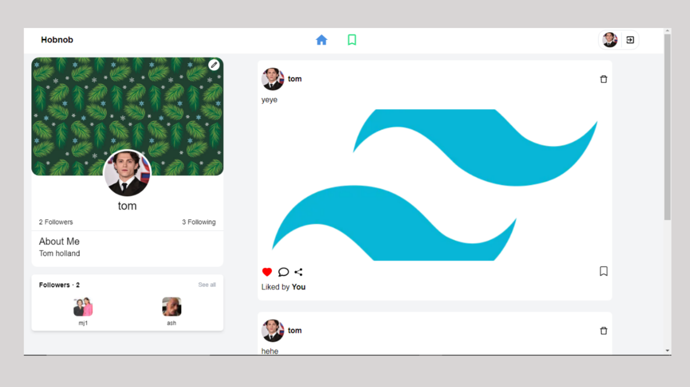

# Hobnob

## A full stack social network website.

### Built With

* [Next.js](https://nextjs.org/)
* [React.js](https://reactjs.org/)
* [Node.js](https://nodejs.org/)
* [Express.js](https://expressjs.com/)
* [MongoDB](https://mongodb.com/)
* [TailwindCSS](https://tailwindcss.com/)

### Installation

1. Clone the repo
   ```sh
   git clone https://github.com/your_username_/Project-Name.git
   ```
2. Install NPM packages
   ```sh
   npm install
   ```
3. Run local server
    ```sh
    npm run dev
    ```
4. Create production build
    ```sh
    npm build
    ```
5. Run build version
    ```sh
    npm start
    ```

### Login Page


### Sign Up Page


### Home Page


### Profile Page

